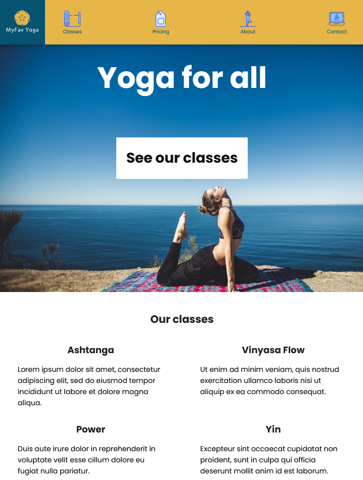
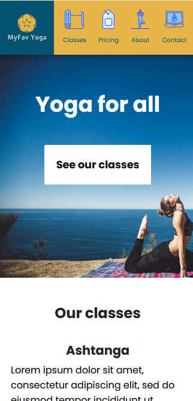

# fcc-product-landing-page
Welcome to my FreeCodeCamp Product Landing Page project!

This website is the landing page for a fictional yoga studio
called MyFav Yoga. Since I'm always in search of the perfect
yoga studio, I figured I'd create a landing page for one!

It's a responsive site for three different screen sizes.

## Larger screens

## Mid-size screens

## Smaller screens

## See the site live

You can see the site live on [Codepen](https://codepen.io/NewWebAsh/full/GRqeRbb)

## See the project description

This site is based on a coding challenge on FreeCodeCamp. See the full
[challenge description here](https://www.freecodecamp.org/learn/responsive-web-design/responsive-web-design-projects/build-a-product-landing-page).

## How to contribute

I'm not currently licensed to accept code contributions. However, if you have
any feedback or suggestions, please tweet me [@NewtonLanguages](https://twitter.com/NewtonLanguages).
